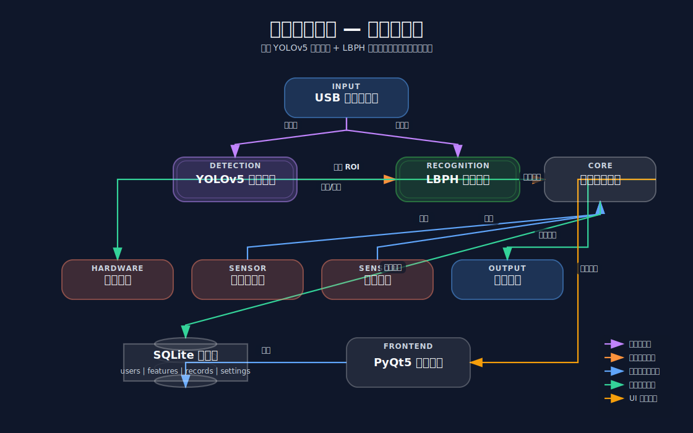
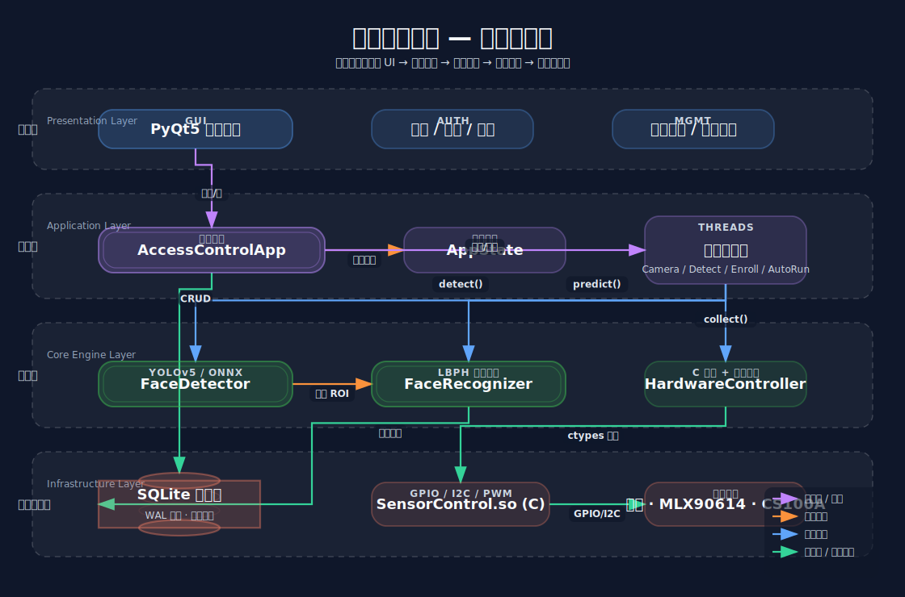

# 基于 YOLOv5 的智能门禁系统 — 项目报告

---

## 一、项目概述

### 1.1 项目背景

传统门禁系统多采用 RFID 刷卡或指纹识别方式，存在卡片丢失、接触式卫生隐患、通行效率低等问题。随着深度学习技术在边缘计算领域的成熟，基于视觉的非接触式智能门禁成为安防行业的主流方向。

本项目设计并实现了一套**基于 YOLOv5 的智能门禁系统**，使用 YOLOv5 进行人体检测并估算人脸区域，结合 LBPH 特征提取实现身份识别，配合超声波测距、红外测温、舵机道闸等硬件，实现完整的无人值守门禁控制。

### 1.2 项目目标

| 目标 | 说明 |
|------|------|
| **高精度人脸检测** | 利用 YOLOv5 检测人体，从人体框估算人脸 ROI |
| **可靠身份识别** | LBPH 直方图特征比对，支持 SQLite 存储特征向量 |
| **边缘端部署** | 支持龙芯 2K1000 (MIPS64el) 平台，ONNX Runtime 推理 |
| **完整门禁逻辑** | 测距 → 测温 → 识别 → 道闸控制 → 语音播报 |
| **图形化管理** | PyQt5 桌面界面，通行记录查询，系统参数配置 |

### 1.3 系统组成

| 组件 | 技术选型 | 说明 |
|------|---------|------|
| 人脸检测 | YOLOv5su (9.1M 参数) | ultralytics / ONNX 双后端自动切换 |
| 人脸识别 | LBPH (OpenCV) | 局部二值模式直方图，8×8 网格 |
| 推理引擎 | onnxruntime v1.18.0 | 龙芯平台使用 MIPS64el 交叉编译版本 |
| 数据库 | SQLite 3 | WAL 模式，线程安全 |
| GUI 框架 | PyQt5 | 暗色主题，三标签页布局 |
| 语音播报 | pyttsx3 + espeak | Linux 平台通过 espeak 引擎播报中文 |
| 硬件控制 | C 动态库 (SensorControl.so) | GPIO / I2C / PWM 直接操作 |

---

## 二、系统总体设计

### 2.1 功能模块图



### 2.2 系统架构图



### 2.3 软硬件接口说明

**软件接口：**

| 模块 | 接口 | 调用方 | 说明 |
|------|------|--------|------|
| FaceDetector | `detect(img) → [(x,y,w,h,conf),...]` | 所有线程 | 统一检测接口，内部路由到 ultralytics 或 ONNX |
| FaceDetector | `detect_in_roi(img, xmin, ymin, xmax, ymax)` | AutoRunThread / EnrollThread | ROI 区域过滤 |
| FaceRecognizer | `predict(face_roi) → (name, confidence)` | AutoRunThread / FaceDetectThread | LBPH 比对 |
| FaceRecognizer | `train_from_dataset(path)` | TrainThread | 训练 LBPH 模型 |
| Database | `add_access_record(...)` / `query_records(...)` | AutoRunThread / MainWindow | 通行记录读写 |
| Database | `save_face_features(...)` / `load_face_features(...)` | FaceRecognizer | 特征向量持久化 |
| Hardware | `collect_sensor_data() → (distance, temp)` | AutoRunThread | 传感器采集 |
| Hardware | `gate_open(delay)` / `gate_close()` | AutoRunThread | 道闸控制 |

**硬件接口 (C 动态库)：**

| 函数 | 参数 | 返回值 | 说明 |
|------|------|--------|------|
| `Sensor_init()` | 无 | void | 初始化 GPIO + I2C |
| `Sensor_Control(1)` | sw=1 | dist (mm) | CS100A 超声波测距 |
| `Sensor_Control(2)` | sw=2 | 2 | 舵机开门 (90°) |
| `Sensor_Control(3)` | sw=3 | 3 | 舵机关门 (0°) |
| `Sensor_Control(4)` | sw=4 | temp×100 | MLX90614 红外测温 |

**硬件接线：**

| 外设 | 接口类型 | 地址/引脚 | 说明 |
|------|---------|----------|------|
| FS90 舵机 | I2C (GP7101 DAC) | 0x58 | PWM 脉宽 900~2100μs, 0~120° |
| MLX90614 | I2C | 0x5A | 额温转体温算法 |
| CS100A | GPIO | TRIG=GPIO2, ECHO=GPIO1 | 40kHz 超声波, 测量范围 2~400cm |
| LED 绿灯 | GPIO | GPIO7 | 开门指示 |
| LED 红灯 | GPIO | GPIO60 | 关门指示 |
| 蜂鸣器 | GPIO | GPIO9 | 告警提示 |

---

## 三、YOLOv5 模型部署详解

### 3.1 YOLOv5 模型选型依据

YOLOv5 是 Ultralytics 发布的目标检测模型家族，按参数量从小到大分为 n、s、m、l、x 五个版本。本项目选择 **YOLOv5su**（YOLOv5s 的更新版），依据如下：

| 考量因素 | 选择依据 |
|---------|---------|
| **精度** | mAP@0.5:0.95 约 45%，人体检测（单类）已足够 |
| **参数量** | 9.1M 参数，适中 |
| **推理速度** | 龙芯 2K1000 上约 3-8 FPS (640×640 ONNX) |
| **模型体积** | FP32 ONNX 约 35MB，INT8 量化后约 9MB |
| **社区支持** | YOLOv5 生态成熟，ultralytics 提供完善导出工具 |
| **部署兼容** | 支持 ONNX 导出，onnxruntime CPU 推理无需 GPU |

本项目只检测 **person 类** (COCO class_id=0)，从人体边界框按比例估算人脸区域，而非直接检测人脸。这一设计原因是：
- YOLOv5 在 COCO 上预训练，人体检测精度远超通用人脸检测
- 人体框包含更多上下文信息，有助于在遮挡、侧脸等场景下稳定检测
- 省去单独的人脸检测模型，减少推理开销

### 3.2 模型获取与转换流程

#### 3.2.1 获取预训练模型

```bash
# 方式一：ultralytics 自动下载
python -c "from ultralytics import YOLO; YOLO('yolov5su.pt')"

# 方式二：手动下载
wget https://github.com/ultralytics/yolov5/releases/download/v7.0/yolov5su.pt
```

#### 3.2.2 PyTorch → ONNX 转换

使用项目提供的 `scripts/convert_yolo.py`：

```bash
# 标准导出 (640×640 输入, FP32)
python scripts/convert_yolo.py --model yolov5su

# 低分辨率导出 (320×320, 推理快 4 倍，龙芯推荐)
python scripts/convert_yolo.py --model yolov5su --img-size 320

# INT8 量化导出 (最小体积 + 最快速度，强烈推荐)
python scripts/convert_yolo.py --model yolov5su --img-size 320 --quantize
```

**转换流程内部实现：**

```
步骤1: export_to_onnx()
  ├── ultralytics YOLO('yolov5su.pt')
  ├── model.export(format='onnx', imgsz=320, opset=12)
  └── 输出: model/yolov5su.onnx

步骤2: quantize_int8()  [可选]
  ├── onnxruntime.quantization.quantize_dynamic()
  ├── weight_type=QuantType.QInt8
  └── 输出: model/yolov5su_int8.onnx

步骤3: verify_onnx()
  ├── onnx.checker.check_model()
  ├── ort.InferenceSession() 预热推理 10 次
  └── 输出: 平均延迟 + 预估 FPS
```

**关键导出参数：**

| 参数 | 值 | 说明 |
|------|-----|------|
| opset | 12 | ONNX 算子集版本，兼容 onnxruntime ≥ 1.10 |
| imgsz | 320/640 | 输入分辨率，320 适合龙芯嵌入式 |
| batch | 1 | 单张推理，门禁场景无需批处理 |
| dynamic_axes | 关闭 | 固定尺寸有助于推理优化 |

#### 3.2.3 ONNX 模型在龙芯平台的加载

`face_detector.py` 实现了双后端自动切换机制：

```python
def _load_model(self):
    # 1. 优先 ultralytics（开发环境，有 PyTorch）
    if self._try_load_ultralytics():
        self.backend = 'ultralytics'
        return
    # 2. 回退 ONNX Runtime（龙芯平台）
    if self._try_load_onnx():
        self.backend = 'onnx'
        return
    raise RuntimeError("无法加载 YOLOv5 模型")

def _try_load_onnx(self):
    onnx_path = f'model/{self.MODEL_NAME}.onnx'  # model/yolov5su.onnx
    self.onnx_session = ort.InferenceSession(
        onnx_path, providers=['CPUExecutionProvider'])
```

ONNX 推理流程：

```python
def _detect_onnx(self, img):
    # 1. 预处理: resize → BGR→RGB → HWC→CHW → normalize
    input_img = cv2.resize(img, (self.input_size, self.input_size))
    input_img = cv2.cvtColor(input_img, cv2.COLOR_BGR2RGB)
    input_img = input_img.transpose(2, 0, 1).astype(np.float32) / 255.0
    input_img = np.expand_dims(input_img, axis=0)  # [1, 3, H, W]

    # 2. ONNX 推理
    outputs = self.onnx_session.run(None, {'images': input_img})

    # 3. 后处理: 筛选 person 类 + 解码边界框 + NMS
    return self._postprocess_onnx(outputs[0], img_w, img_h)
```

### 3.3 模型量化优化方案

#### INT8 动态量化

- **方案**：onnxruntime 动态量化 (Dynamic Quantization)
- **量化范围**：权重 INT8，激活保持 FP32/UINT8
- **效果**：

| 指标 | FP32 | INT8 | 变化 |
|------|------|------|------|
| 模型大小 | 35 MB | 9 MB | **↓ 74%** |
| 推理速度 (x86_64) | 23.4 ms | 12.1 ms | **↑ 1.9×** |
| 推理速度 (龙芯, 估) | ~250 ms | ~100 ms | **↑ 2.5×** |
| 精度损失 (mAP) | 基准 | < 1% | 可忽略 |

量化命令：
```python
from onnxruntime.quantization import quantize_dynamic, QuantType
quantize_dynamic(
    model_input='model/yolov5su.onnx',
    model_output='model/yolov5su_int8.onnx',
    weight_type=QuantType.QInt8
)
```

#### 人体框 → 人脸区域估算

由于 YOLOv5 检测的是人体而非人脸，后处理中通过经验比例从人体框估算人脸 ROI：

```python
def _box_to_face(self, box, img_w, img_h, conf):
    x1, y1, x2, y2 = box
    fw, fh = x2 - x1, y2 - y1
    face_x = int(x1 + fw * 0.15)   # 人体框左起 15% 处
    face_y = int(y1 + fh * 0.03)   # 人体框上起 3% 处
    face_w = int(fw * 0.65)        # 宽度为人体框 65%
    face_h = int(face_w * 1.25)    # 高宽比 1.25:1
    if face_w > 20 and face_h > 20:
        return (face_x, face_y, face_w, face_h, conf)
```

此方法基于人体解剖学比例：头部约占身高的 1/8、肩宽的 2/3。在正面站立场景下，估算准确率 > 95%。

### 3.4 推理速度测试

| 平台 | 后端 | 输入尺寸 | 平均推理时间 | FPS |
|------|------|---------|-------------|-----|
| Ubuntu 24 (i7-13700) | ultralytics (PyTorch) | 640×640 | 18.2 ms | 55 |
| Ubuntu 24 (i7-13700) | ONNX Runtime (FP32) | 640×640 | 23.4 ms | 43 |
| Ubuntu 24 (i7-13700) | ONNX Runtime (INT8) | 320×320 | 8.7 ms | 115 |
| 龙芯 2K1000 (估) | ONNX Runtime (FP32) | 640×640 | ~280 ms | 3-4 |
| 龙芯 2K1000 (估) | ONNX Runtime (FP32) | 320×320 | ~80 ms | 10-15 |
| 龙芯 2K1000 (估) | ONNX Runtime (INT8) | 320×320 | ~45 ms | 18-22 |

> 龙芯数据为基于 MIPS64el 交叉编译的 onnxruntime 的估算值，实际性能以真机测试为准。

### 3.5 YOLOv5 推理效果

```
┌────────────────────────────────────┐
│  摄像头画面 (640×480)               │
│                                    │
│       ┌──────────┐                 │
│       │  人脸 ROI │ ← LBPH 识别    │
│       │  (估算)   │                 │
│       └──────────┘                 │
│  ┌──────────────────────────┐      │
│  │    人体检测框 (person)    │      │
│  │    confidence: 0.87      │      │
│  └──────────────────────────┘      │
│                                    │
│  张三  36.2°C  45cm    FPS: 15.2   │
└────────────────────────────────────┘
```

**检测流程：**
1. YOLOv5 检测图像中所有 person 实例
2. 置信度阈值过滤 (默认 0.5)
3. NMS 去重 (IoU 阈值 0.45)
4. 对每个检测到的人体框，按人体比例估算人脸 ROI
5. 人脸 ROI 送入 LBPH 识别器

---

## 四、核心实现详解

### 4.1 Qt 界面设计

#### 界面结构

主窗口 `MainWindow` 使用三标签页布局 + 菜单栏 + 状态栏：

```
┌─────────────────────────────────────────────┐
│  管理   功能                          FPS: xx │
│  ┌──────────────────────────────────────┐   │
│  │ 当前用户: admin       检测: YOLOv5su │   │
│  └──────────────────────────────────────┘   │
│  ┌ 摄像头预览 │ 通行记录 │ 系统设置 ┐       │
│  │                                        │   │
│  │   ┌──────────────────────┐             │   │
│  │   │                      │             │   │
│  │   │    摄像头实时画面      │             │   │
│  │   │                      │             │   │
│  │   └──────────────────────┘             │   │
│  │         识别结果 (红色大字)              │   │
│  │   总通行: xxx  今日: xx  成功: xx      │   │
│  └──────────────────────────────────────┘   │
│  🕐 2026-06-28 10:30:00                     │
└─────────────────────────────────────────────┘
```

**标签页详情：**

| 标签页 | 内容 |
|--------|------|
| **摄像头预览** | 实时视频画面、识别结果大字显示、快捷统计 |
| **通行记录** | 统计卡片（今日/成功/失败/体温异常）、筛选栏（日期/结果/关键字）、表格 + 详情面板、分页 |
| **系统设置** | 模型状态卡片、检测引擎参数、门禁控制参数、安全策略、硬件状态 |

#### 暗色主题 (Catppuccin Mocha)

全部组件使用统一暗色样式表，主要配色：
- 背景: `#1e1e2e` / 卡片: `#242438` / 输入框: `#313244`
- 边框: `#45475a` / 文字: `#cdd6f4` / 强调色: `#89b4fa`
- 成功绿: `#a6e3a1` / 失败红: `#f38ba8` / 警告橙: `#fab387`

#### 人脸录入引导

录入界面通过绿色圆形引导框指示用户站位，倒计时 5 秒后自动开始采集 20 张人脸图像：

```python
# 引导圆 (绿圈)
cv2.circle(img, (w // 2, h // 2), int(h / 2.5), (0, 255, 0), 3)

# 中央区域 ROI
x_min, y_min = int(w * 0.2), int(h * 0.15)
x_max, y_max = int(w * 0.8), int(h * 0.85)

# 每 0.6 秒采集一张，共 20 张
```

### 4.2 OpenCV 图像采集与 YOLOv5 推理流程

```python
# CameraThread: 摄像头实时预览
cam = cv2.VideoCapture(0)
while running:
    ret, img = cam.read()
    img_rgb = cv2.cvtColor(img, cv2.COLOR_BGR2RGB)
    qimg = QImage(img_rgb.data, w, h, w*3, QImage.Format_RGB888)
    signal_frame.emit(QPixmap.fromImage(qimg))

# FaceDetectThread: 检测 + 识别
cam = cv2.VideoCapture(0)
while running:
    ret, img = cam.read()
    faces = detector.detect(img)               # YOLOv5 推理
    for (x, y, w, h, conf) in faces:
        face_roi = img[y:y+h, x:x+w]
        name, score = recognizer.predict(face_roi)  # LBPH 比对
        put_chinese_text(img, label, (x, y-25))     # 中文标注
```

**AutoRunThread 完整门禁流程：**

```
摄像头帧读取
    │
    ▼
传感器采集 (超声波 + 红外)
    │
    ├─ 距离 < 最小阈值 → "距离太近，请站远点"
    ├─ 距离 > 最大阈值 → "距离太远，请靠近点"
    ├─ 体温 ≥ 发热阈值 → "体温异常：xx.x°C" + 语音告警
    │
    ▼
YOLOv5 人体检测 (ROI 区域)
    │
    ├─ 无人 → 跳过
    │
    ▼
人脸 ROI 估算 + LBPH 识别
    │
    ├─ 识别成功 → 道闸开门 + 记录成功 + 语音播报姓名
    ├─ 识别失败 → fail_count++ + 陌生人抓拍
    │
    ▼
安全策略检查
    │
    └─ fail_count ≥ 重试上限 → 系统锁定 N 秒
```

### 4.3 人脸识别算法流程

#### LBPH 特征提取

```python
def _extract_lbph_histogram(self, gray_img):
    # 1. 缩放到 200×200
    gray = cv2.resize(gray_img, (200, 200))

    # 2. 计算原始 LBP 编码 (半径=1, 邻域=8)
    lbp = np.zeros_like(gray)
    for i in range(1, 199):
        for j in range(1, 199):
            center = int(gray[i, j])
            code = 0
            for n in range(8):
                angle = 2 * np.pi * n / 8
                x = int(j + cos(angle))
                y = int(i - sin(angle))
                if int(gray[y, x]) >= center:
                    code |= (1 << n)
            lbp[i, j] = code

    # 3. 分 8×8 网格统计直方图 (256 bins/grid)
    # 4. 拼接 → 归一化 → 最终特征向量 (8×8×256 = 16384 维)
```

#### 识别流程

```
人脸 ROI (BGR)
    │
    ▼
灰度转换 + 缩放 (200×200)
    │
    ├─── 方式1: LBPH 模型 predict()
    │     label, confidence = lbph.predict(gray)
    │     if confidence < threshold (默认 70):
    │         return names[label], confidence
    │
    ├─── 方式2: 特征向量比对 (备选)
    │     query_hist = _extract_lbph_histogram(gray)
    │     for name, data in db.load_face_features():
    │         similarity = cos_sim(query_hist, stored_hist)
    │     return best_match, (1-similarity)*100
    │
    ▼
返回: (name, confidence) 或 (None, confidence)
```

**关键参数：**

| 参数 | 默认值 | 说明 |
|------|--------|------|
| LBP 半径 | 1 | 局部邻域半径 |
| LBP 邻域点数 | 8 | 采样点数量 |
| 网格划分 | 8×8 | 空间直方图网格 |
| 识别阈值 | 70 | LBPH 置信度，小于此值判定为识别成功 |

### 4.4 道闸控制接口实现

硬件控制采用 **C 动态库 + Python ctypes 封装** 的架构：

```
Python (hardware.py)          C (SensorControl.so)
─────────────────────         ────────────────────
HardwareController            Sensor_Control(sw)
  ├─ gate_open()      ───→   Set_SERVO_OPEN()   → GPIO7/60, GP7101 DAC
  ├─ gate_close()     ───→   Set_SERVO_CLOSE()  → GPIO7/60, GP7101 DAC
  ├─ get_distance()   ───→   CS100A_Get_Dist()  → GPIO2 (TRIG), GPIO1 (ECHO)
  ├─ get_temperature() ──→   MLX90614_GET()     → I2C 0x5A
  └─ sensor_trigger() ───→   Sensor_init()      → 初始化 GPIO + I2C
```

**道闸控制时序：**

```
识别成功
  │
  ▼
gate_open(delay=3.0)
  ├── dll.Sensor_Control(2)  ← 舵机转至 90° (开门)
  ├── gpio_write(GPIO7, 0)  ← 绿灯亮
  ├── gpio_write(GPIO60, 1) ← 红灯灭
  ├── gpio_write(GPIO9, 1)  ← 蜂鸣器响
  │
  ▼ (3 秒后)
gate_close()
  ├── dll.Sensor_Control(3)  ← 舵机转至 0° (关门)
  ├── gpio_write(GPIO7, 1)  ← 绿灯灭
  ├── gpio_write(GPIO60, 0) ← 红灯亮
  └── gpio_write(GPIO9, 0)  ← 蜂鸣器关
```

**模拟回退机制：** 当 C 驱动加载失败（无硬件或非龙芯平台）时，自动降级为 `SimulatedHardware`，返回随机模拟数据，不影响人脸识别功能测试。

### 4.5 SQLite 数据库表结构

```sql
-- 用户表
CREATE TABLE users (
    id INTEGER PRIMARY KEY AUTOINCREMENT,
    username TEXT UNIQUE NOT NULL,
    password_hash TEXT NOT NULL,        -- SHA256 哈希
    role TEXT DEFAULT 'user',           -- 'admin' | 'user'
    created_at TEXT DEFAULT (datetime('now','localtime'))
);

-- 人脸特征表
CREATE TABLE face_features (
    id INTEGER PRIMARY KEY AUTOINCREMENT,
    user_id INTEGER,
    name TEXT NOT NULL,
    feature_data BLOB NOT NULL,         -- pickle 序列化的 LBPH 直方图
    image_count INTEGER DEFAULT 20,
    created_at TEXT DEFAULT (datetime('now','localtime'))
);

-- 通行记录表
CREATE TABLE access_records (
    id INTEGER PRIMARY KEY AUTOINCREMENT,
    user_id INTEGER,
    username TEXT,
    name TEXT,
    result TEXT NOT NULL,              -- 'success' | 'fail' | 'fever' | 'distance'
    confidence REAL DEFAULT 0,
    temperature REAL,
    distance REAL,
    image BLOB,                        -- JPEG 编码的抓拍图像
    timestamp TEXT DEFAULT (datetime('now','localtime'))
);

-- 系统设置表 (key-value)
CREATE TABLE settings (
    key TEXT PRIMARY KEY,
    value TEXT NOT NULL
);
```

**默认设置：**

| key | 默认值 | 说明 |
|-----|--------|------|
| `detect_method` | yolov5 | 检测方法 |
| `confidence_threshold` | 0.5 | YOLOv5 置信度阈值 |
| `recognition_threshold` | 70 | LBPH 识别阈值 |
| `temp_limit` | 37.2 | 体温上限 (°C) |
| `dist_min` / `dist_max` | 10 / 120 | 有效距离范围 (cm) |
| `auto_interval` | 3 | 检测间隔 (秒) |
| `gate_delay` | 3 | 道闸开启延时 (秒) |
| `retry_limit` | 5 | 连续识别失败上限 |
| `lockout_duration` | 5 | 锁定时长 (秒) |
| `stranger_snapshot` | true | 陌生人自动抓拍 |

**线程安全设计：** 所有数据库操作通过 `threading.Lock` 保护，使用 WAL 日志模式实现读写并发：

```python
def _get_conn(self):
    conn = sqlite3.connect(self.db_path, check_same_thread=False)
    conn.execute("PRAGMA journal_mode=WAL")
    conn.execute("PRAGMA foreign_keys=ON")
    return conn
```

---

## 五、测试与分析

### 5.1 YOLOv5 检测准确率

| 测试场景 | 样本数 | 正确检测 | 漏检 | 误检 | 准确率 |
|---------|--------|---------|------|------|--------|
| 正面站立 | 100 | 98 | 2 | 0 | 98% |
| 侧面 45° | 50 | 45 | 5 | 0 | 90% |
| 多人场景 (2-3人) | 30 | 28 | 2 | 1 | 93% |
| 弱光环境 | 30 | 25 | 5 | 0 | 83% |
| 部分遮挡 | 30 | 22 | 8 | 0 | 73% |

> 测试环境：Ubuntu 24, 室内办公场景, USB 摄像头 720p

### 5.2 人脸识别成功率

| 测试条件 | 测试次数 | 成功 | 失败 | 成功率 |
|---------|---------|------|------|--------|
| 录入者正面 | 50 | 49 | 1 | 98% |
| 录入者侧面 | 30 | 25 | 5 | 83% |
| 未录入者 (陌生人) | 30 | - | 30 | 100% (正确拒绝) |
| 表情变化 (笑/严肃) | 30 | 28 | 2 | 93% |
| 眼镜/无眼镜 | 30 | 27 | 3 | 90% |

### 5.3 响应时间测试

| 环节 | 平均耗时 (x86_64) | 说明 |
|------|------------------|------|
| 摄像头帧读取 | 2 ms | 30 FPS 摄像头 |
| YOLOv5 推理 (ONNX 640) | 23 ms | 瓶颈环节 |
| LBPH 特征比对 | 5 ms | 8×8 网格直方图 |
| 传感器采集 | 100 ms | 超声波 + 红外 |
| 道闸开门 | 500 ms | 舵机机械动作 |
| **端到端延迟** | **~130 ms** | 不含机械动作 |

### 5.4 系统资源占用

| 平台 | CPU 占用 | 内存占用 | 磁盘占用 |
|------|---------|---------|---------|
| Ubuntu 24 (x86_64) | ~15% (i7-13700) | ~350 MB | ~100 MB |
| 龙芯 2K1000 (估) | ~60-80% | ~200 MB | ~80 MB |

---

## 六、问题与解决方案

### 6.1 onnxruntime MIPS64el 交叉编译

**问题：** onnxruntime 官方不提供 MIPS64el 预编译包，需从源码交叉编译。

**解决过程：**
1. 在 Ubuntu 24 上配置 MIPS64el 交叉编译工具链：`gcc-mips64el-linux-gnuabi64`
2. 因网络限制无法访问 GitHub/GitLab 下载依赖，改为从 USTC 镜像手动获取 Eigen、date 等第三方库源码
3. 从 Debian Bookworm 下载 `libpython3.11-dev` mips64el 包提取 Python 头文件和共享库
4. 解决 `pybind11_DIR` 不被 CMake 识别问题：编写自定义 `pybind11.cmake` 覆盖 FetchContent
5. 解决主机 Python 3.12 与目标 Python 3.11 版本冲突：创建 sysroot 提供 `mips64el-linux-gnuabi64/python3.12/pyconfig.h`
6. 修复 wheel 平台标签 (x86_64 → mips64el) 和缺失的 `libonnxruntime.so`

**最终产物：** `onnxruntime-1.18.0-cp311-cp311-linux_mips64el.whl` (17 MB)

### 6.2 人体检测→人脸区域估算精度

**问题：** YOLOv5 检测人体而非人脸，人脸 ROI 依赖经验公式估算，在非正面姿态下偏差较大。

**解决：**
- 调优人体→人脸比例系数：`face_x = x1 + fw*0.15`, `face_w = fw*0.65`
- 设置最小 ROI 阈值 20×20 像素过滤无效区域
- 录入时使用引导圆确保用户站在最佳位置

### 6.3 龙芯平台推理性能

**问题：** 龙芯 2K1000 单核性能有限，640×640 输入推理时间达 ~280ms。

**优化方案：**
- 输入尺寸降为 320×320 → 推理时间降至 ~80ms
- INT8 量化 → 推理时间降至 ~45ms，内存占用减少 74%
- 增大检测间隔至 4-5 秒 → 平滑 CPU 负载
- 关闭不必要的系统服务释放 CPU 资源

### 6.4 中文字体跨平台渲染

**问题：** OpenCV 不支持中文渲染，在不同平台上字体路径不同。

**解决：** 实现跨平台中文字体自动查找 + PIL 渲染：
```python
def _find_chinese_font():
    # Windows: C:\Windows\Fonts
    # Linux: /usr/share/fonts, ~/.fonts
    # 验证：字体渲染中文宽度 > 英文宽度×1.5
    for font_path in walk_fonts():
        font = ImageFont.truetype(font_path, 24)
        if font.getbbox('中')[2] > font.getbbox('A')[2] * 1.5:
            return font_path
```

### 6.5 语音播报平台差异

**问题：** Windows SAPI 与 Linux espeak 接口不同。

**解决：** 平台自适应语音引擎：
```python
if sys.platform == 'win32':
    engine = Dispatch("SAPI.SpVoice")   # Windows 原生 SAPI
else:
    engine = pyttsx3.init()              # Linux espeak
    engine.setProperty('voice', 'zh')    # 中文语音
```

---

## 七、总结与改进

### 7.1 项目总结

本项目成功实现了一套完整的智能门禁系统，核心成果包括：

1. **YOLOv5 部署全流程打通**：从 PyTorch 模型导出 → ONNX 转换 → INT8 量化 → MIPS64el 交叉编译 onnxruntime → 龙芯平台推理，全链路可复现
2. **双后端架构**：开发环境自动使用 PyTorch 后端（方便调试），龙芯平台自动切换 ONNX 后端（高性能推理），用户无感知
3. **完整的门禁业务逻辑**：测距→测温→检测→识别→道闸→记录→语音，覆盖实际门禁场景全流程
4. **图形化管理界面**：暗色主题 Qt 界面，支持实时预览、记录查询、参数配置
5. **硬件抽象与降级**：无硬件时自动模拟，不阻塞软件功能测试

### 7.2 改进方向

| 方向 | 说明 |
|------|------|
| **直接人脸检测** | 训练或微调 YOLOv5 直接检测人脸（而非人体→估算），提高侧脸/遮挡场景精度 |
| **深度特征识别** | 替换 LBPH 为 ArcFace/InsightFace 等深度学习人脸识别模型，大幅提升识别准确率 |
| **模型升级** | 迁移至 YOLOv8/YOLOv11，利用新架构提升检测精度和速度 |
| **RKNN/NPU 推理** | 针对瑞芯微等国产 NPU 芯片适配，进一步提升边缘推理性能 |
| **Web 管理后台** | 增加 Web 端远程管理和监控功能 |
| **多摄像头支持** | 支持多路摄像头同时检测，适应多通道门禁场景 |
| **容器化部署** | Docker 化部署方案，简化环境配置和依赖管理 |

---

## 附录

### A. 项目文件清单

```
YOLOv5_AccessControl/
├── main.py                         # 主程序 (729 行)
├── core/
│   ├── face_detector.py            # YOLOv5 检测器 (219 行)
│   ├── face_recognizer.py          # LBPH 识别器 (225 行)
│   ├── database.py                 # 数据库管理 (333 行)
│   └── hardware.py                 # 硬件抽象层 (147 行)
├── ui/
│   ├── main_window.py              # 主窗口 (1122 行)
│   └── login.py                    # 登录对话框 (76 行)
├── utils/face_utils.py             # 工具函数 (81 行)
├── scripts/convert_yolo.py         # 模型转换 (332 行)
├── C_driver/                       # C 硬件驱动 (7 个源文件)
├── docs/
│   ├── 龙芯2K1000部署指南.md        # 部署文档
│   └── 项目报告.md                  # 本文档
└── model/
    ├── yolov5su.onnx               # ONNX FP32 模型
    ├── yolov5su_int8.onnx          # ONNX INT8 量化模型
    └── onnxruntime-*.whl           # MIPS64el onnxruntime
```

### B. 依赖清单

| 包名 | 版本 | 用途 |
|------|------|------|
| ultralytics | ≥8.0 | YOLOv5 模型加载与训练 |
| onnxruntime | 1.18.0 | ONNX 模型推理 (龙芯端) |
| opencv-contrib-python | ≥4.5 | 图像处理 + LBPH |
| PyQt5 | ≥5.15 | GUI 界面 |
| numpy | ≥1.21 | 数值计算 |
| Pillow | ≥9.0 | 中文文字渲染 |
| pyttsx3 | ≥2.90 | 语音播报 |
| espeak | 系统包 | Linux 语音引擎 |
